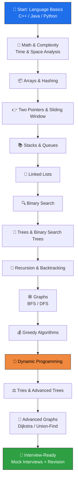

<h1 align="center">🧠 Data Structures & Algorithms</h1>

<p align="center">
  A curated collection of my problem-solving journey — DSA concepts, LeetCode solutions, and algorithmic patterns, solved and synced automatically.
</p>

<p align="center">
  
  
  
</p>

---

### 💭 Why this repo exists

> *"Everyone wants to be a great developer, but nobody wants to solve problems on the hard days too."*

This repo isn't just a code dump — it's proof of **consistency**. Every folder here is a day I sat down and chose to think instead of giving up. DSA isn't about being naturally gifted at logic — it's about **pattern recognition built through repetition**. This is my log of that repetition.

If you're reading this while stuck on your own problem — good. Struggling is the only part of the process that actually works. Push the commit anyway.

---

## 🗺️ My DSA Roadmap

The path I'm following from fundamentals to interview-ready, top to bottom. This is the flow, not a checklist to rush — completed stages will get marked ✅ as I go.



**Current focus:** working through the middle of this roadmap — one topic at a time, no skipping ahead just to feel productive.

---

## 📂 Repository Structure

Each problem gets its own folder, named after the problem, containing the solution and any notes on approach.

```
Data-Structures-and-Algorithms/
│
├── 1-two-sum/
│   └── solution.*
│
├── 2-<next-problem>/
│   └── solution.*
│
└── README.md
```

> New folders are added automatically as problems get solved and synced via **LeetSync** — every commit here is a real solve, not a copy-paste.

---

## 📖 Topics Covered

| Stage | Topic | Status |
|---|---|:---:|
| 1 | Arrays & Hashing | 🔄 |
| 2 | Two Pointers | ⬜ |
| 3 | Sliding Window | ⬜ |
| 4 | Stacks & Queues | ⬜ |
| 5 | Binary Search | ⬜ |
| 6 | Linked Lists | ⬜ |
| 7 | Trees & BSTs | ⬜ |
| 8 | Recursion & Backtracking | ⬜ |
| 9 | Graphs (BFS/DFS) | ⬜ |
| 10 | Greedy | ⬜ |
| 11 | Dynamic Programming | ⬜ |
| 12 | Tries & Advanced Trees | ⬜ |
| 13 | Advanced Graphs | ⬜ |

✅ Done · 🔄 In Progress · ⬜ Upcoming
*(update this table as each topic gets crossed off — it's the most satisfying part.)*

---

## 🛠️ Tech / Tools Used

| Category | Tools |
|---|---|
| Languages | C++, Java, Python |
| Sync Tool | LeetSync (auto-commits solved problems) |
| Practice Platform | LeetCode |

---

## 🔥 Rules I'm Following

- No skipping a topic just because it's boring — boring topics show up in interviews the most.
- Every problem gets attempted for at least 20–25 mins before looking at a hint.
- Revisit old folders every couple of weeks — solving once means nothing without revision.
- Progress over perfection. A messy solution that works today beats a perfect one that never gets written.

---

<p align="center">⭐ Star this repo if you're on a similar grind — let's keep each other accountable.</p>
